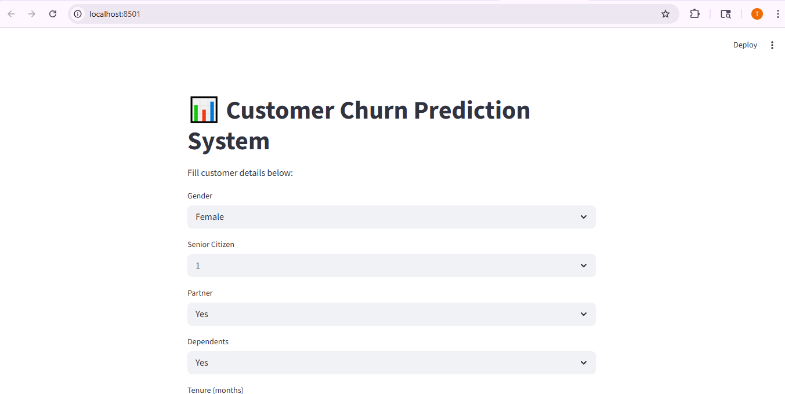
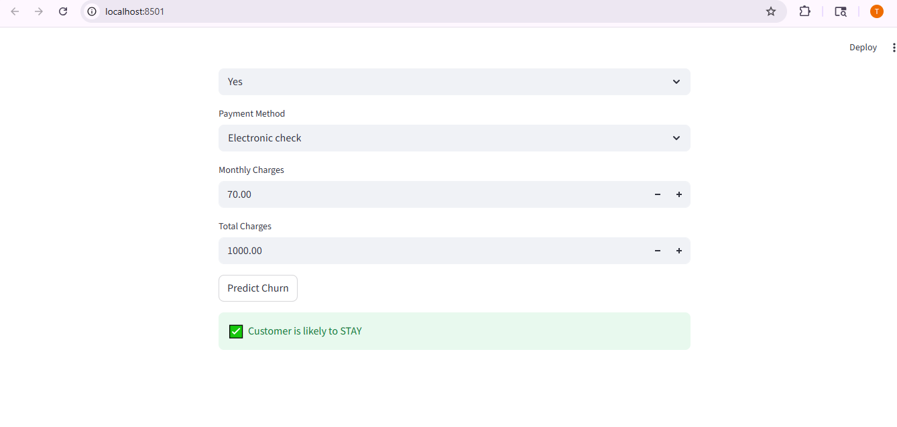
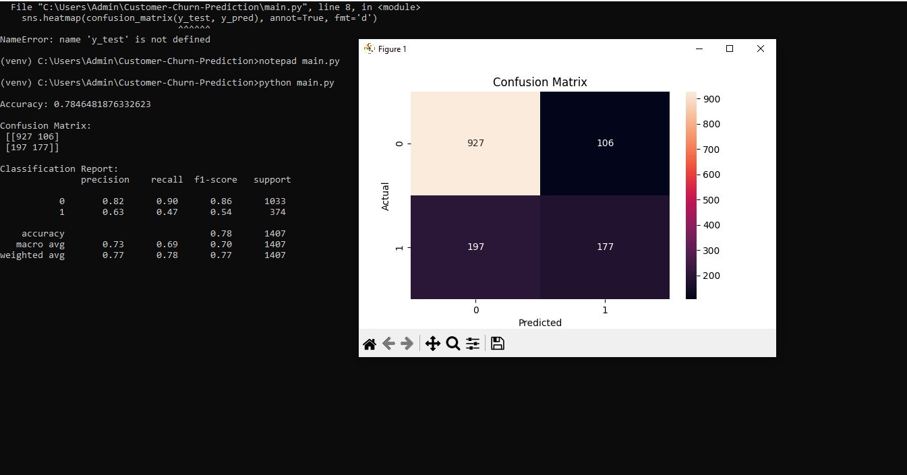
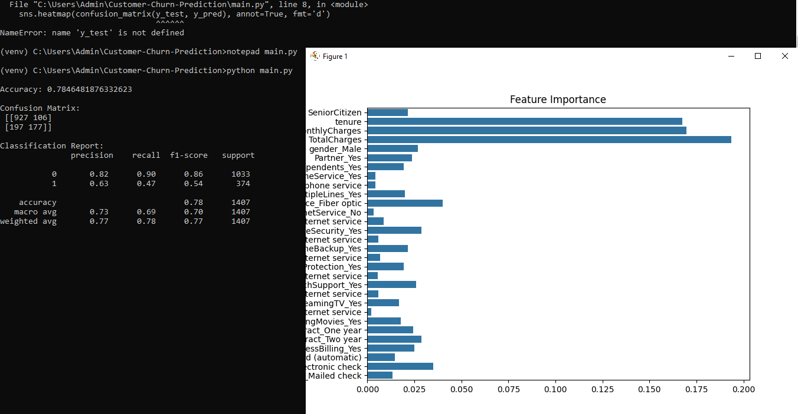

# 📊 Customer Churn Prediction Model

---

## 🚀 Overview

This project is an end-to-end Machine Learning solution designed to predict whether a customer is likely to churn (leave the service). It helps businesses identify at-risk customers and take proactive retention actions.

---

## 🎯 Objectives

* Predict customer churn (Yes / No)
* Analyze key factors influencing churn
* Build an interactive dashboard for real-time predictions
* Demonstrate an industry-level ML pipeline

---

## 🛠️ Tech Stack

* **Programming Language:** Python
* **Libraries:** Pandas, NumPy, Scikit-learn
* **Visualization:** Matplotlib, Seaborn
* **Deployment/UI:** Streamlit
* **Model:** Random Forest Classifier

---

## 📂 Project Structure

```
Customer-Churn-Prediction/
│
├── data/
├── models/
├── outputs/
├── images/
├── notebooks/
├── src/
├── app.py
├── main.py
├── requirements.txt
└── README.md
```

---

## 🔍 Workflow

1. Data Collection (Telco Dataset)
2. Data Cleaning & Preprocessing
3. Feature Engineering
4. Model Training (Random Forest)
5. Model Evaluation
6. Visualization (Confusion Matrix & Feature Importance)
7. Deployment using Streamlit Dashboard

---

## 📈 Model Performance

* **Accuracy:** ~78%
* Improved recall using class balancing
* Evaluated using:

  * Confusion Matrix
  * Precision, Recall, F1-score

---

## 🧠 Key Insights

* Customers with **month-to-month contracts** are more likely to churn
* Higher **monthly charges** increase churn probability
* Customers with **longer tenure** are less likely to churn

---

## 📊 Screenshots

### 🔹 Streamlit Dashboard UI



### 🔹 Prediction Result



### 🔹 Confusion Matrix



### 🔹 Feature Importance



---

## 💻 How to Run

### 1️⃣ Install dependencies

```
pip install -r requirements.txt
```

### 2️⃣ Run ML model

```
python main.py
```

### 3️⃣ Run Streamlit app

```
streamlit run app.py
```

---

## ⚠️ Important Notes

* Ensure virtual environment is activated
* Dataset should be placed in `data/` folder
* Model files (`.pkl`) should be in `models/` folder

---

## 🔮 Future Improvements

* Hyperparameter tuning
* Use advanced models (XGBoost, LightGBM)
* Deploy using FastAPI
* Cloud deployment (AWS / Render)
* Add real-time data integration

---

## 💼 Resume Highlight

> Built a Customer Churn Prediction system using Random Forest achieving ~78% accuracy and improved churn detection using class balancing. Developed an interactive Streamlit dashboard for real-time predictions.

---

## 👩‍💻 Author

**Tanuja**
B.Tech CSE (AI & ML)

---

## ⭐ If you like this project

Give it a ⭐ on GitHub and share it!
